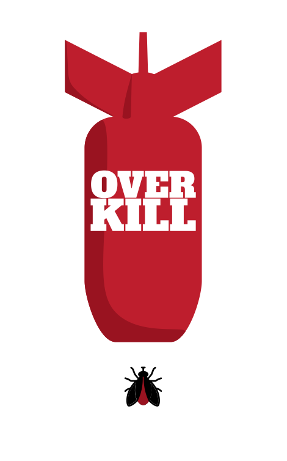
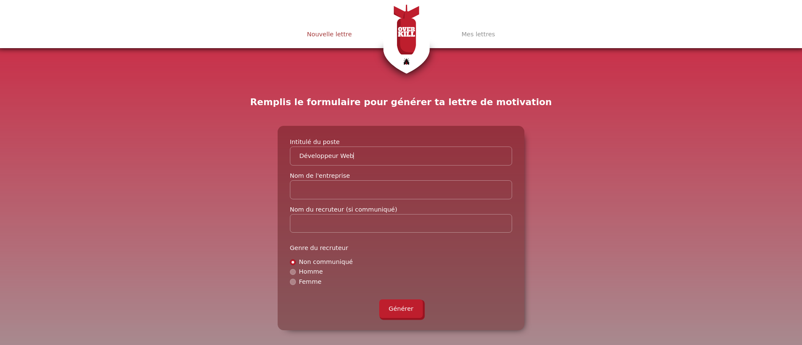
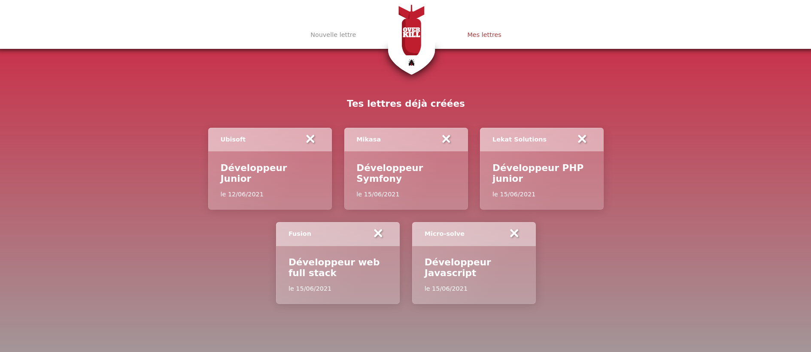
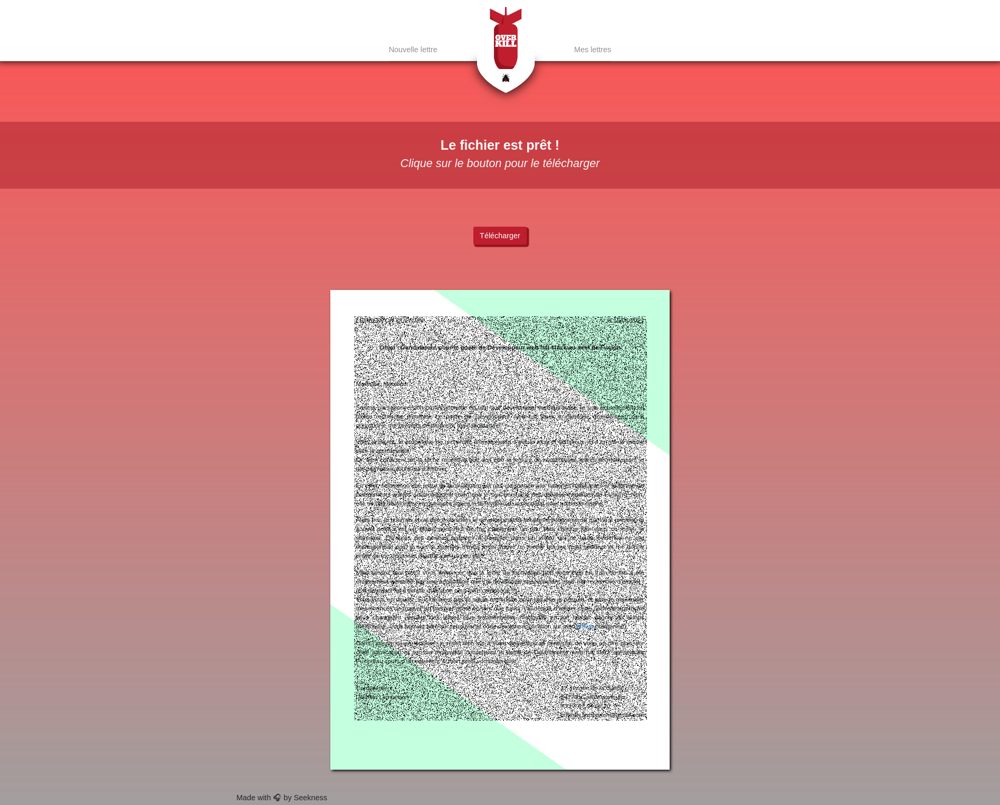
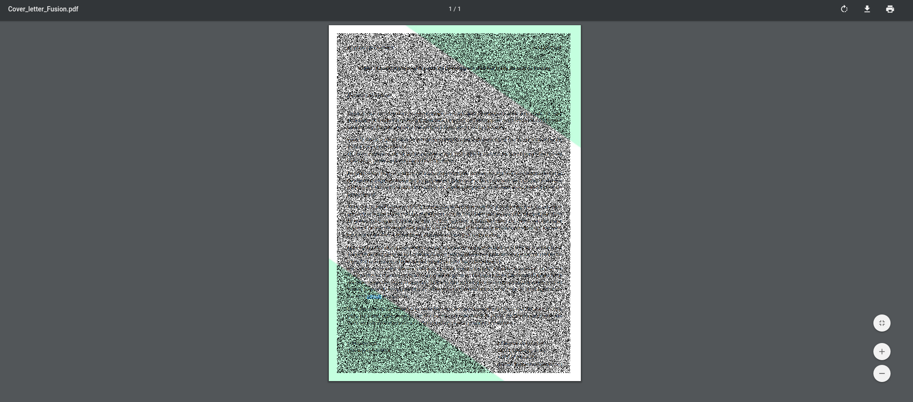

# Overkill
## _A smart cover letter generator_

Overkill is an application that allows a user (me) to generate a cover letter using a simple form.
The core of the letter will be always the same, but few variables will change (name of the company, job title, date etc..)
That letter is then available in a downloadable pdf document ready to be sent.

## Features

- Convert an HTML page into a pdf document
- Archives of your previous cover letters
- Smart adaptative text generation (depending on the recruitment person's gender / the usage of a "de" or a "d' ")
- A clean and easy to learn interface

## Tech

- [Symfony](https://symfony.com/) 
- [Doctrine](https://www.doctrine-project.org/) - Database
- [Twig](https://twig.symfony.com/doc/3.x/) - Html integration
- [Bootstrap4.6](https://getbootstrap.com/)
- [wkhtmltopdf](https://wkhtmltopdf.org/) & [KnpSnappyBundle](https://github.com/KnpLabs/KnpSnappyBundle) - Convert Html into a pdf document

## Screenshots

